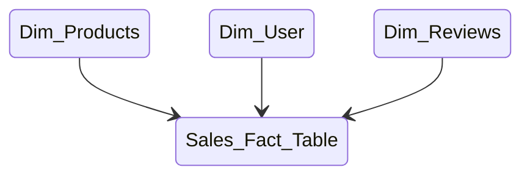

## Dynamic Tables Tutorial

In this tutorial, we’ll be exploring how to construct a database, schema, and table within Snowflake. We’ll also delve into creating a set of Dynamic Tables, and implementing the concept of [Star Schema](https://en.wikipedia.org/wiki/Star_schema).

**This tutorial assumes that you have created a trial account within Snowflake and able to confidently navigate Snowflake.**

### Table of Contents

- [Dynamic Tables Tutorial](#dynamic-tables-tutorial)
  - [Table of Contents](#table-of-contents)
- [Business Case](#business-case)
- [Creating the ETL\_WAREHOUSE](#creating-the-etl_warehouse)
- [Altering the ETL\_WAREHOUSE](#altering-the-etl_warehouse)
- [Creating a BRONZE Database](#creating-a-bronze-database)
- [Creating a SILVER Database](#creating-a-silver-database)
- [Creating a AWS Schema](#creating-a-aws-schema)
- [Creating a AWS Schema (Continued)](#creating-a-aws-schema-continued)
- [Import and Alter AWS\_Raw\_Data](#import-and-alter-aws_raw_data)
- [Create the Dynamic Tables](#create-the-dynamic-tables)
  - [AWS\_DIM\_PRODUCTS Table](#aws_dim_products-table)
  - [AWS\_DIM\_USER Table](#aws_dim_user-table)
  - [AWS\_DIM\_REVIEW Table](#aws_dim_review-table)
  - [AWS\_SALES\_FACT\_TABLE Table](#aws_sales_fact_table-table)
- [Clean up and Conclusion](#clean-up-and-conclusion)
  - [Drop AWS\_Raw\_Data table](#drop-aws_raw_data-table)
  - [Drop AWS\_DIM\_PRODUCTS Dynamic Table](#drop-aws_dim_products-dynamic-table)
  - [AWS\_DIM\_USER Dynamic Table](#aws_dim_user-dynamic-table)
  - [Drop AWS\_DIM\_REVIEW Dynamic Table](#drop-aws_dim_review-dynamic-table)
  - [Drop AWS\_SALES\_FACT\_TABLE Dynamic Table](#drop-aws_sales_fact_table-dynamic-table)
  - [Drop Bronze AWS Schema](#drop-bronze-aws-schema)
  - [Drop Silver AWS Schema](#drop-silver-aws-schema)
  - [Drop Bronze Database](#drop-bronze-database)
  - [Drop Silver Database](#drop-silver-database)

## Business Case

Imagine a retail company, “UK Retail Ltd.”, that has a vast product portfolio.......

UK Retail Ltd have been facing challenges in managing their product data due to its volume and complexity. To address this, they decide that there is a business case for the creation of a Snowflake database named **“BRONZE”**.

In **“BRONZE”**, they would like a schema called **“AWS”** and a table **“AWS_RAW_DATA”** to hold the raw sales data from Amazon Web Services. 

This data may include product details, prices, customer reviews and even discounts, and more. As the data is updated frequently, they would like you to try the new Snowflake Dynamic Table object to create a collection of **Fact** and ** Dimension** tables called **“AWS_DIM_PRODUCTS”**, **"AWS_DIM_USER"**, **"AWS_DIM_REVIEW"**, **"AWS_SALES_FACT_TABLE"** using the **“AWS_RAW_DATA”** table to capture changes, automate refreshing and analyse the data to gain meaningful insights.

The team at UK Retail Ltd would like a table called **“AWS_RAW_DATA”** to hold the raw data provided by  a file called `Amazon.csv` and believe that using a Dynamic Table to transform the raw data into a collection of dimensions and a fact table, will be able to derive insights using their BI tool of choice.  

This would allow the team at UK Retail Ltd to maintain a full history of raw data and with this setup, UK Retail Ltd will be able to manage their sales data more efficiently, leading to better business decisions.

This tutorial aims to design the dynamic tables needed within the Snowflake platform. As part of a proof of concept, we’ll utilise the `Amazon.csv` file, implement `COMMENT ON` information and rename columns dynamically, building a Star Schema data model.

Below is a rudimentary example of a **Star Schema**. 



## Creating the ETL_WAREHOUSE

Once you’re logged in, you can create a warehouse named “ELT_WAREHOUSE” with the following SQL command:
```sql 
USE ROLE ORGADMIN;
CREATE WAREHOUSE IF NOT EXISTS ELT_WAREHOUSE 
WITH WAREHOUSE_SIZE = 'XSMALL' 
WAREHOUSE_TYPE = 'STANDARD' 
AUTO_SUSPEND = 180 
AUTO_RESUME = TRUE 
MIN_CLUSTER_COUNT = 1 
MAX_CLUSTER_COUNT = 1 
SCALING_POLICY = 'STANDARD';
```

## Altering the ETL_WAREHOUSE

Now we have created the `ETL WAREHOUSE`, we want to ensure that commenting is placed on the object, so users understand its purpose, using the following SQL command, using `ALTER`, `SET`, and `COMMENT`:
```sql
USE ROLE ORGADMIN; 
ALTER WAREHOUSE IF EXISTS ELT_WAREHOUSE
SET
    COMMENT = 'Dedicated ELT workload warehouse.';
```
## Creating a BRONZE Database

Now we want to focus on creating the BRONZE database needed to hold our raw data, you can create your database named “BRONZE” with the following SQL command:
```sql
USE ROLE ORGADMIN;
CREATE OR REPLACE DATABASE BRONZE 
DATA_RETENTION_TIME_IN_DAYS = 1 
COMMENT = 'This is the Bronze database for raw, unprocessed data.';
```

In this example, `DATA_RETENTION_TIME_IN_DAYS` is set to `1`, which means Snowflake will retain historical data for only a single day if the table has the `DROP` command applied. This can be changed with more information provided [here](https://docs.snowflake.com/en/user-guide/data-time-travel).

The `COMMENT` is used to describe the purpose of the database, which is a good practice for maintainability and clarity.

## Creating a SILVER Database

Now we want to focus on creating the SILVER database needed to hold our raw data, you can create your database named “SILVER” with the following SQL command:

```sql
USE ROLE ORGADMIN;
CREATE OR REPLACE DATABASE SILVER 
DATA_RETENTION_TIME_IN_DAYS = 0 
COMMENT = 'This is the Silver database for processed, system-defined data.';
```

In this example, `DATA_RETENTION_TIME_IN_DAYS` is set to `0`, which means Snowflake will **not** retain historical data if the table has the `DROP` command applied. This can be changed with more information provided [here](https://docs.snowflake.com/en/user-guide/data-time-travel).

The `COMMENT` is used to describe the purpose of the database, which is a good practice for maintainability and clarity.

## Creating a AWS Schema

Before creating a schema, make sure you’re using the correct database. If you want to create the `AWS` schema in the `BRONZE` database, you would use the following command:

```sql 
USE ROLE ORGADMIN;
USE DATABASE BRONZE;
```
Now you can create the `AWS` schema with the following command:

```sql
USE ROLE ORGADMIN;
CREATE SCHEMA IF NOT EXISTS AWS 
COMMENT = 'This schema contains all the AWS related raw data tables';
```
To confirm that the schema has been created, you can use the following command to list all schemas in the current database:

```sql 
USE ROLE ORGADMIN;
SHOW SCHEMAS;
```
The `AWS` schema should appear in the output list.

Alternatively, you should be able to simply remove the `;` at the end of the `USE DATABASE` command and run as a singular query, below is an example.

```sql
USE ROLE ORGADMIN;
USE DATABASE BRONZE
CREATE SCHEMA IF NOT EXISTS AWS 
COMMENT = 'This schema contains all the AWS related raw data tables';
```
## Creating a AWS Schema (Continued)

Before creating a schema, make sure you’re using the correct database. If you want to create the `AWS` schema in the `SILVER` database, you would use the following command:

```sql
USE ROLE ORGADMIN;
USE DATABASE SILVER;
```
Now you can create the `AWS` schema with the following command:

```sql
USE ROLE ORGADMIN;
CREATE SCHEMA IF NOT EXISTS AWS 
COMMENT = 'This schema contains all the AWS related processed tables';
```
To confirm that the schema has been created, you can use the following command to list all schemas in the current database:

```sql
USE ROLE ORGADMIN;
SHOW SCHEMAS;
```
The `AWS` `SILVER` database schema should appear in the output list.

Alternatively, you should be able to simply remove the `;` at the end of the `USE DATABASE` command and run as a singular query, below is an example.

```sql
USE ROLE ORGADMIN;
USE DATABASE SILVER
CREATE SCHEMA IF NOT EXISTS AWS COMMENT = 'This schema contains all the AWS related processed tables';
```
## Import and Alter AWS_Raw_Data

We will need to load data into the `AWS_Raw_Data` table to initially import data, this information is stored within `amazon.csv`.

Once the manual import has been completed successfully, let's add some commenting through the use of the `COMMENT` command to each column within `AWS_RAW_DATA`, using the query below:

```sql
USE ROLE ORGADMIN;
USE DATABASE BRONZE;
ALTER TABLE
    BRONZE.AWS.AWS_RAW_DATA ALTER PRODUCT_ID COMMENT 'Product ID';
USE ROLE ORGADMIN;
USE DATABASE BRONZE;
ALTER TABLE
    BRONZE.AWS.AWS_RAW_DATA ALTER PRODUCT_NAME COMMENT 'Name of the Product';
USE ROLE ORGADMIN;
USE DATABASE BRONZE;
ALTER TABLE
    BRONZE.AWS.AWS_RAW_DATA ALTER CATEGORY COMMENT 'Category of the Product';
USE ROLE ORGADMIN;
USE DATABASE BRONZE;
ALTER TABLE
    BRONZE.AWS.AWS_RAW_DATA ALTER DISCOUNTED_PRICE COMMENT 'Discounted Price of the Product';
USE ROLE ORGADMIN;
USE DATABASE BRONZE;
ALTER TABLE
    BRONZE.AWS.AWS_RAW_DATA ALTER ACTUAL_PRICE COMMENT 'Actual Price of the Product';
USE ROLE ORGADMIN;
USE DATABASE BRONZE;
ALTER TABLE
    BRONZE.AWS.AWS_RAW_DATA ALTER DISCOUNT_PERCENTAGE COMMENT 'Percentage of Discount for the Product';
USE ROLE ORGADMIN;
USE DATABASE BRONZE;
ALTER TABLE
    BRONZE.AWS.AWS_RAW_DATA ALTER RATING COMMENT 'Rating of the Product';
USE ROLE ORGADMIN;
USE DATABASE BRONZE;
ALTER TABLE
    BRONZE.AWS.AWS_RAW_DATA ALTER RATING_COUNT COMMENT 'Number of people who voted for the Amazon rating';
USE ROLE ORGADMIN;
USE DATABASE BRONZE;
ALTER TABLE
    BRONZE.AWS.AWS_RAW_DATA ALTER ABOUT_PRODUCT COMMENT 'Description about the Product';
USE ROLE ORGADMIN;
USE DATABASE BRONZE;
ALTER TABLE
    BRONZE.AWS.AWS_RAW_DATA ALTER USER_ID COMMENT 'ID of the user who wrote review for the Product';
USE ROLE ORGADMIN;
USE DATABASE BRONZE;
ALTER TABLE
    BRONZE.AWS.AWS_RAW_DATA ALTER USER_NAME COMMENT 'Name of the user who wrote review for the Product';
USE ROLE ORGADMIN;
USE DATABASE BRONZE;
ALTER TABLE
    BRONZE.AWS.AWS_RAW_DATA ALTER REVIEW_ID COMMENT 'ID of the user review';
USE ROLE ORGADMIN;
USE DATABASE BRONZE;
ALTER TABLE
    BRONZE.AWS.AWS_RAW_DATA ALTER REVIEW_TITLE COMMENT 'Short review';
USE ROLE ORGADMIN;
USE DATABASE BRONZE;
ALTER TABLE
    BRONZE.AWS.AWS_RAW_DATA ALTER REVIEW_CONTENT COMMENT 'Long review';
USE ROLE ORGADMIN;
USE DATABASE BRONZE;
ALTER TABLE
    BRONZE.AWS.AWS_RAW_DATA ALTER IMG_LINK COMMENT 'Image Link of the Product';
USE ROLE ORGADMIN;
USE DATABASE BRONZE;
ALTER TABLE
    BRONZE.AWS.AWS_RAW_DATA ALTER PRODUCT_LINK COMMENT 'Official Website Link of the Product';
```
By using the `ALTER TABLE` command we are able to make modifications to the table's metadata and not the actual data within the table itself. We have also used `USE ROLE ORGADMIN;`
and `USE DATABASE BRONZE;` to support the tutorial.

## Create the Dynamic Tables

As identified in the business case, there are 4 tables required **AWS_DIM_PRODUCTS**, **AWS_DIM_REVIEW**, **AWS_DIM_USER**, and **AWS_SALES_FACT_TABLE**. 

### AWS_DIM_PRODUCTS Table

The following command will create the **AWS_DIM_PRODUCTS** dynamic table:
```sql
USE ROLE ORGADMIN;
USE DATABASE SILVER; 
CREATE OR REPLACE DYNAMIC TABLE SILVER.AWS.AWS_DIM_PRODUCTS 
TARGET_LAG = '10 minute' 
WAREHOUSE = ELT_WAREHOUSE 
AS
SELECT
    DISTINCT PRODUCT_ID AS AWS_PRODUCT_ID,
    PRODUCT_NAME AS AWS_PRODUCT_NAME,
    CATEGORY AS AWS_PRODUCT_CATEGORY,
    IMG_LINK AS AWS_IMG_LINK,
    PRODUCT_LINK AS AWS_PRODUCT_LINK
FROM
    BRONZE.AWS.AWS_RAW_DATA;
```

### AWS_DIM_USER Table

The following command will create the **AWS_DIM_USER** dynamic table:
```sql
USE ROLE ORGADMIN;
USE DATABASE SILVER CREATE
OR REPLACE DYNAMIC TABLE SILVER.AWS.AWS_DIM_USER 
TARGET_LAG = '10 minute' 
WAREHOUSE = ELT_WAREHOUSE 
AS
SELECT
    DISTINCT USER_ID AS AWS_USER_ID PRIMARY KEY,
    USER_NAME AS AWS_USER_NAME
FROM
    BRONZE.AWS.AWS_RAW_DATA;
```

### AWS_DIM_REVIEW Table

The following command will create the **AWS_DIM_REVIEW** dynamic table:
```sql
USE ROLE ORGADMIN;
USE DATABASE SILVER 
CREATE OR REPLACE DYNAMIC TABLE SILVER.AWS.AWS_DIM_REVIEW 
TARGET_LAG = '10 minute' 
WAREHOUSE = ELT_WAREHOUSE 
AS
SELECT
    DISTINCT REVIEW_ID AS AWS_REVIEW_ID PRIMARY KEY,
    REVIEW_TITLE AS AWS_REVIEW_TITLE,
    REVIEW_CONTENT AS AWS_REVIEW_CONTENT
FROM
    BRONZE.AWS.AWS_RAW_DATA;
```
### AWS_SALES_FACT_TABLE Table

The following command will create the **AWS_SALES_FACT_TABLE** dynamic table:
```sql
USE ROLE ORGADMIN;
USE DATABASE SILVER 
CREATE OR REPLACE DYNAMIC TABLE SILVER.AWS.AWS_SALES_FACT_TABLE 
TARGET_LAG = '10 minute' 
WAREHOUSE = ELT_WAREHOUSE 
AS
SELECT
    PRODUCT_ID AS AWS_PRODUCT_ID,
    ACTUAL_PRICE AS AWS_ACTUAL_PRICE,
    DISCOUNTED_PRICE AS AWS_DISCOUNTED_PRICE,
    DISCOUNT_PERCENTAGE AS AWS_DISCOUNT_PERCENTAGE,
    USER_ID AS AWS_USER_ID,
    REVIEW_ID AS AWS_REVIEW_ID
FROM
    BRONZE.AWS.AWS_RAW_DATA;
```

## Clean up and Conclusion

**Once completed with the tutorial**, to ensure that you do not incur costs, we must run the below commands:

### Drop AWS_Raw_Data table
```sql
USE ROLE ORGADMIN;
USE DATABASE BRONZE
DROP TABLE AWS_RAW_DATA
```

### Drop AWS_DIM_PRODUCTS Dynamic Table
```sql
USE ROLE ORGADMIN;
USE DATABASE SILVER
DROP DYNAMIC TABLE SILVER.AWS.AWS_RAW_DATA.AWS_DIM_PRODUCTS;
```

### AWS_DIM_USER Dynamic Table
```sql
USE ROLE ORGADMIN;
USE DATABASE SILVER
DROP DYNAMIC TABLE SILVER.AWS.AWS_RAW_DATA.AWS_DIM_USER;
```

### Drop AWS_DIM_REVIEW Dynamic Table

```sql
USE ROLE ORGADMIN;
USE DATABASE SILVER
DROP DYNAMIC TABLE SILVER.AWS.AWS_RAW_DATA.AWS_DIM_REVIEW;
```

### Drop AWS_SALES_FACT_TABLE Dynamic Table

```sql
USE ROLE ORGADMIN;
USE DATABASE SILVER
DROP DYNAMIC TABLE SILVER.AWS.AWS_SALES_FACT_TABLE;
```

### Drop Bronze AWS Schema

```sql
USE ROLE ORGADMIN;
USE DATABASE BRONZE
DROP SCHEMA AWS;
```

### Drop Silver AWS Schema

```sql
USE ROLE ORGADMIN;
USE DATABASE SILVER
DROP SCHEMA BRONZE;
```

### Drop Bronze Database

```sql
USE ROLE ORGADMIN;
DROP DATABASE BRONZE;
```

### Drop Silver Database

```sql
USE ROLE ORGADMIN;
DROP DATABASE SILVER;
```
